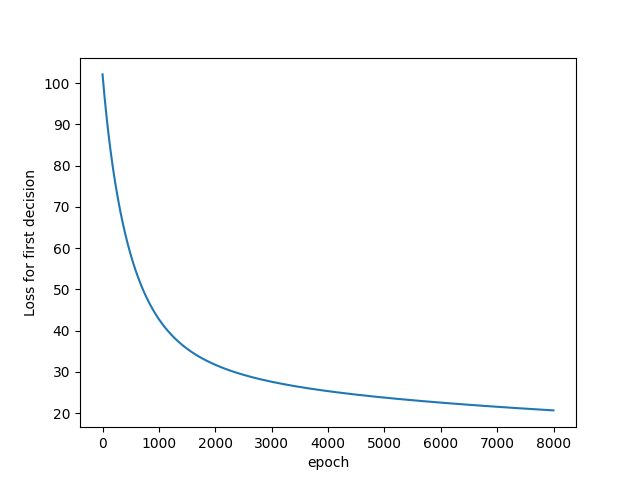
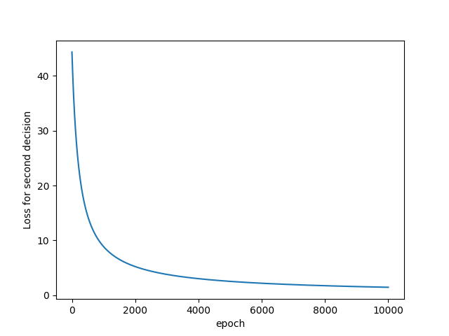
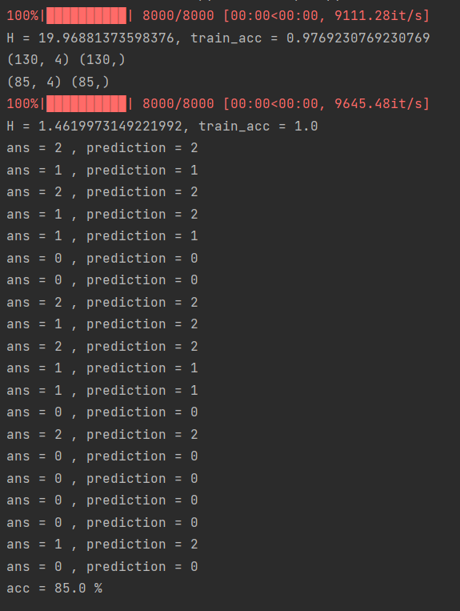

# DecisionTree with numpy

## Data

* Iris dataset

## Comment 
* I was planned to implement DecisionTree. But this is just binary classification iteration for multi classification
* I think the important part of " Decision Tree " is the algorithm how the node choose the feature represented output well. So Decision Tree use "CART algo" or "ID3 algo" or " c4.5"
* The thing I have to do next is remake the Decision Tree using the algorithms I told and "Gini Index" ( or entropy )

